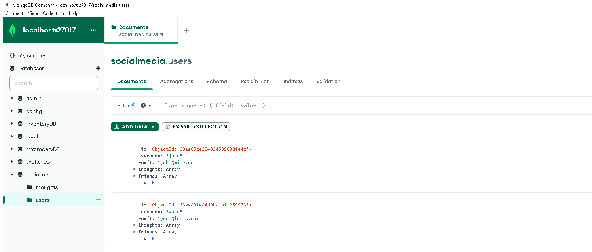

# NoSQL-Social-Network-API
Module 18 Challenge-NoSQL Challenge: Social Network API

This project is an API for a social network web application where users can share thoughts, reactions, create a friends' list and react their friend's thoughts. I used `Express.js` to route, `MongoDB` for a database, `Mongoose` Object Data Modeling library, `Insomnia` to seed data, and `Moment.js` to create timestamps.


# Table of Contents

- [License](#license)
- [Badges](#badges)
- [Demo & Screenshots](#screenshots)
- [Installation and Usage](#installation-and-usage)
- [Usage](#Usage)
- [Technologies Used](#technologies-used)
- [Project Link](#project-link)
- [Contributing and Questions](#contributing-and-questions)

# Demo & Screenshots

Insomnia

MongoDB



# Installation and Usage

Start install and run with:
Install:
```
npm install
```
```
npm i mongodb
```
Run:
```
npm start
```

# Usage
Using Insomia we will be testing API routes to create, add, update, and remove users. They will have options to add, remove, update, or delete their friends, thoughts, and reactions.
#### USER
    - Create a new user
    - Get all users
    - Get a single user by its id
    - Update a user by its id
    - Delete a user by its id

#### FRIEND
    - Add a friend to a user's friend list
    - Delete a friend from a user's friend list

#### THOUGHT
    - Create a new thought
    - Get all thoughts
    - Get a single thought by its id
    - Update a thought by its id
    - Delete a thought by its id

#### REACTION
    - Create a reaction
    - Delete a reaction by the reactionId

# Technologies Used
- Express
- Insomnia
- Javascript
- MongoDB
- Mongoose
- Node.js

# Project Link
Github: 
Live Video: https://drive.google.com/file/d/1ErFeE_6A7ED3eT9_4r8WzSuTG_ETEePg/view?usp=share_link